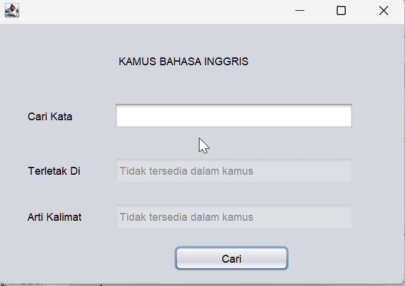

<h4 align="center">Simple Application dictionary using Hash Table.</h4>

## Anggota Kelompok 
 - Adi Esa Putra - 23552011230
 - Indra Hermawan - 23552011372
 - Gita Aulia Hafid - 23552011050

## Penjelasan Kode Program
```bash
    private void cariButtonActionPerformed(java.awt.event.ActionEvent evt) {                                           
      String inputKata = SearchText.getText();
      dictionary kamus = new dictionary();
      String hasil = kamus.cariLokasi(inputKata);
      String arti = kamus.cariArti(inputKata);
      indexAt.setText(hasil);
      meaningText.setText(arti);
    }                  
```
kode program diatas implementasi dari dua fungsi cariLokasi dan cariArti dari file dictionary yang hasil 
dari kedua fungsi tersebut disimpan ke variavle indexAt dan meaning text.
<hr>

```bash
public String cariLokasi(String kata){
        for(Integer key: dictionary.keySet()){
            entry e = dictionary.get(key);
            if(e.getEnglish().equalsIgnoreCase(kata) || e.getArti().equalsIgnoreCase(kata)){
                return "tersedia di baris ke -" + key;
            }
        }
        return "Tidak tersedia dalam kamus";
    }
```
Kode program diatas untuk pencarian lokasi dari kata yang sedang dicari baik bahasa indonesia maupun bahasa inggris
<hr>

```bash
 public String cariArti(String kata){
        for(Integer key: dictionary.keySet()){
            entry e = dictionary.get(key);
            if(e.getEnglish().equalsIgnoreCase(kata) || e.getArti().equalsIgnoreCase(kata)){
                return "Arti Dari Kalimat " + (e.getEnglish().equalsIgnoreCase(kata) ? e.getArti() : e.getEnglish());
            }
        }
        return "Tidak tersedia dalam kamus";
    }
```
Kode program diatas untuk pencarian arti kata dari kata yang sedang dicari baik bahasa indonesia maupun bahasa inggris

<hr>

## Demo

